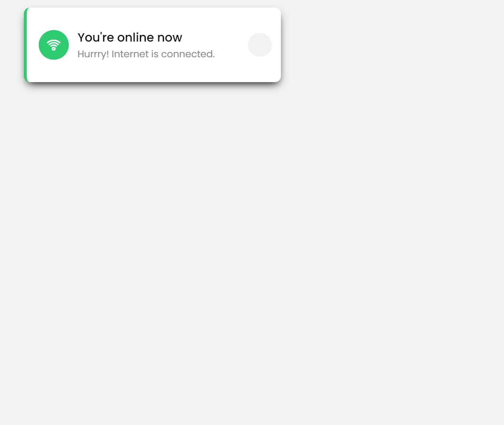
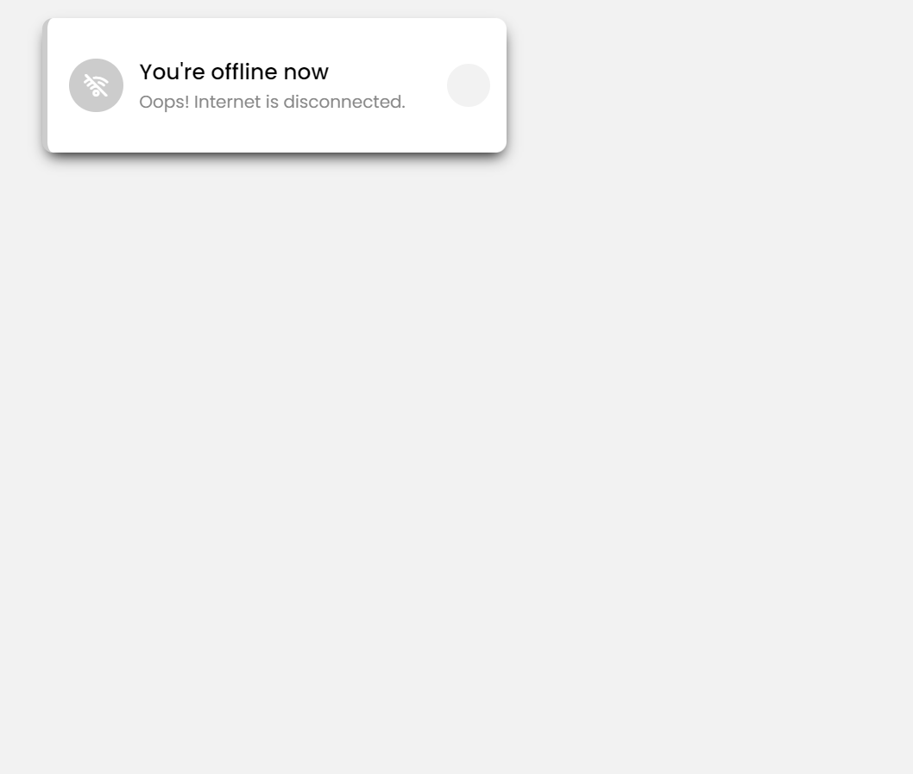

# Internet Connection Status Checker

This project is a simple web application that checks the user's internet connection status and displays a notification when the user goes offline or comes back online. It uses HTML, CSS, and JavaScript to achieve this functionality.

## Table of Contents

- [Live Demo](#live-demo)
- [Features](#features)
- [Technologies Used](#technologies-used)
- [Project Structure](#project-structure)
- [How It Works](#how-it-works)
- [Screenshots](#screenshots)
- [Installation](#installation)
- [Future Enhancements](#future-enhancements)
- [Acknowledgments](#acknowledgments)
- [Contact](#contact)

## Live Demo

You can see the live demo of the project [here](https://prashanth0718.github.io/Internet-Connection-Status-Checker/).

## Features

- **Real-time Connection Status**: The app checks the internet connection status every 100ms and displays a notification if the user goes offline or online.
- **Toast Notification**: A toast notification with a smooth sliding animation appears at the top-left corner of the screen when the connection status changes.
- **Dynamic Icons and Messages**: The toast includes a Wi-Fi icon and a message that updates based on the connection status.

## Technologies Used

- **HTML**: Structuring the webpage.
- **CSS**: Styling the toast notification and adding animations.
- **JavaScript**: Handling the AJAX requests and updating the DOM based on the connection status.

## Project Structure

```
├── index.html
├── style.css
└── script.js
```

- **index.html**: The main HTML file that includes the structure of the toast notification.
- **style.css**: The stylesheet that handles the appearance and animations of the toast.
- **script.js**: The JavaScript file responsible for checking the internet connection status and updating the UI.

## How It Works

1. **AJAX Request**: The script sends an AJAX request to a public API (`https://jsonplaceholder.typicode.com/posts`) every 100ms.
2. **Connection Check**: If the request is successful (status code 200-299), the app assumes the user is online. Otherwise, it assumes the user is offline.
3. **Notification Display**: The app displays a toast notification indicating whether the user is online or offline. The notification disappears automatically after 5 seconds or can be closed manually by the user.

## Screenshots

Here are some screenshots of the project in action:

- **Online Status:**

  

- **Offline Status:**

  

*(Replace the example URLs with the actual URLs of your screenshots.)*

## Installation

1. Clone this repository:
   ```bash
   git clone https://github.com/Prashanth0718/Internet-Connection-Status-Checker.git
   ```
2. Navigate to the project directory:
   ```bash
   cd Internet-Connection-Status-Checker
   ```
3. Open the `index.html` file in your browser:
   ```bash
   open index.html
   ```

## Future Enhancements

- Improve offline detection accuracy.
- Add support for different notification styles.
- Provide more customization options for users.

## Acknowledgments

- [Icons by Unicons](https://iconscout.com/unicons)
- [API used: JSONPlaceholder](https://jsonplaceholder.typicode.com/)

## Contact

For any questions or feedback, please contact me at [prashanthsn2003@gmail.com](mailto:prashanthsn2003@gmail.com).

---

You can add screenshots to your GitHub repository (usually in a `screenshots` folder) and then update the screenshot URLs in the README.
